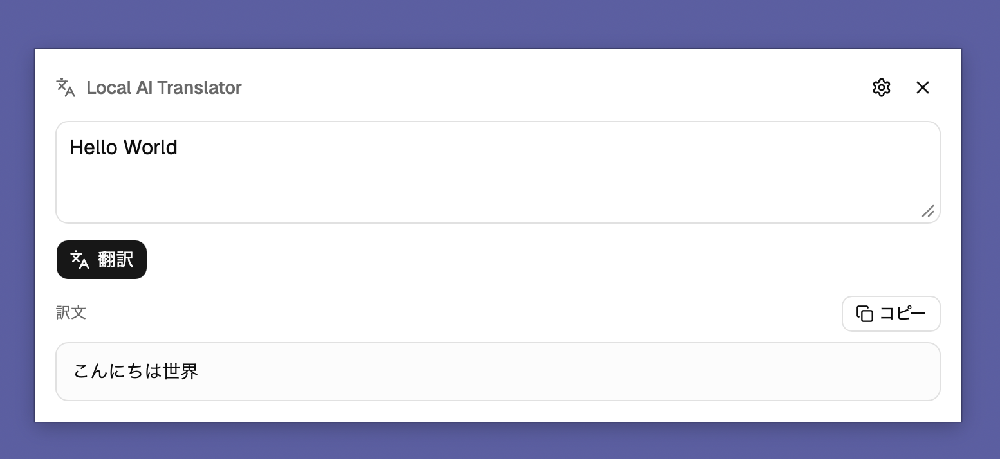

# Local AI Translator

macOS のメニューバーに常駐し、選択した英文を `cmd+J` で即座に日本語へ翻訳するアプリ。
翻訳はローカル LLM（Ollama）で完結し、テキストは外部へ一切送信されない。



## 動作環境

- macOS（Apple Silicon / Intel どちらも可）
- [Ollama](https://ollama.com) がインストール済みで常駐していること
- 翻訳モデルが事前に pull 済みであること（後述）

## 事前準備

### 1. Ollama のインストール

```bash
brew install ollama
```

### 2. 翻訳モデルの取得

デフォルトモデルは `qwen2.5:14b`。以下のコマンドで pull する（約 9 GB）。

```bash
ollama pull qwen2.5:14b
```

軽量モデルを使いたい場合は `qwen2.5:7b`（約 4.7 GB）でも動作する。

```bash
ollama pull qwen2.5:7b
```

### 3. Ollama の起動

ログイン時に自動起動するサービスとして登録しておくと便利。

```bash
brew services start ollama
```

都度起動する場合は `ollama serve`（ターミナルを閉じると停止する）。

### 4. macOS アクセシビリティ権限の付与

アプリは `cmd+C` の擬似送信で選択テキストを取得するため、アクセシビリティ権限が必要。

- アプリを初回起動するとセットアップ画面が表示されるので、そこから「システム設定」を開いて権限を付与する。
- 開発中（`pnpm tauri dev`）の場合はターミナルまたは Visual Studio Code に対して権限を付与する。

---

## 開発環境のセットアップ

### 必要なツール

| ツール | バージョン | インストール |
|--------|-----------|-------------|
| Node.js | 20 以上 | `brew install node` |
| pnpm | 最新 | `npm install -g pnpm` |
| Rust | stable | `curl --proto '=https' --tlsv1.2 -sSf https://sh.rustup.rs \| sh` |
| Xcode Command Line Tools | 最新 | `xcode-select --install` |

### 依存パッケージのインストール

```bash
pnpm install
```

---

## 起動方法

### 開発モード

```bash
pnpm tauri dev
```

Vite の開発サーバーと Tauri バックエンドが同時に起動する。ホットリロード対応。

### プロダクションビルド

```bash
pnpm tauri build
```

`src-tauri/target/release/bundle/` 以下に `.app` および `.dmg` が生成される。

---

## 使い方

1. アプリを起動するとメニューバーにアイコンが表示される（Dock には出ない）。
2. ブラウザや Teams などで英語テキストを選択した状態で `cmd+J` を押す。
3. 画面中央上に翻訳ウィンドウが表示され、日本語訳がストリーミングで流れる。
4. 翻訳結果をコピーしたい場合はコピーボタンを押す。
5. `cmd+J` または閉じるボタンでウィンドウが非表示になる。

テキストを選択せずに `cmd+J` を押すと、ウィンドウに直接入力して翻訳することもできる。

---

## 設定

メニューバーアイコン → **Settings** から以下を変更できる。

| 設定項目 | デフォルト値 | 説明 |
|----------|-------------|------|
| Model | `qwen2.5:14b` | 使用する Ollama モデル名 |
| Endpoint | `http://localhost:11434` | Ollama の API エンドポイント |

設定は `~/.config/local-ai-translator/config.json` に保存される。

---

## モデルのアップデート方法

### 別のモデルに切り替える

1. 使用したいモデルを pull する。

   ```bash
   # 例: より軽量なモデル
   ollama pull qwen2.5:7b

   # 例: より高精度なモデル
   ollama pull qwen2.5:32b
   ```

2. アプリの Settings 画面で **Model** フィールドを変更して保存する。

### 既存モデルを最新版に更新する

```bash
ollama pull qwen2.5:14b
```

同じモデル名で pull し直すと最新バージョンに更新される。

### インストール済みモデルの確認

```bash
ollama list
```

---

## アーキテクチャ概要

```
フロントエンド（React / TypeScript）
    ↕ Tauri コマンド＆イベント
バックエンド（Rust / Tauri v2）
    ↕ HTTP POST（ストリーミング）
Ollama（ローカル LLM サーバー）
```

- **グローバルショートカット**：`cmd+J` でウィンドウ表示前にクリップボード経由で選択テキストを取得
- **ストリーミング翻訳**：Ollama の `/api/chat` から逐次トークンを受信し、フロントエンドにイベントで送信
- **モデルウォームアップ**：起動時に空リクエストを送ってモデルをメモリに展開し、初回翻訳の遅延を低減

## 技術スタック

- **Tauri v2**（Rust バックエンド）
- **React 19 + TypeScript**（フロントエンド）
- **shadcn/ui + Tailwind CSS v4**（UI コンポーネント）
- **Ollama**（ローカル LLM ランタイム）
